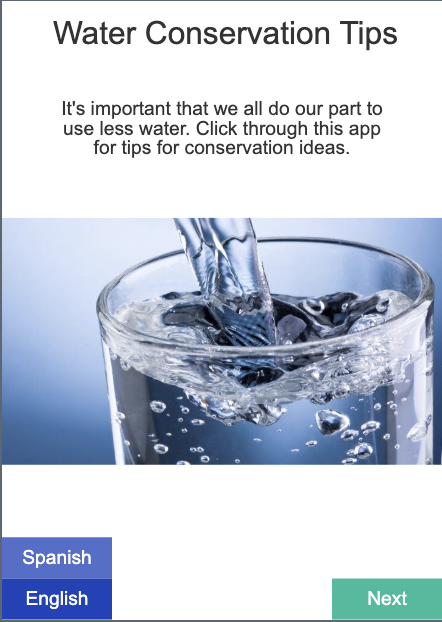

# The Bootstrap CSS Framework

## Step 1: Why Bootstrap?

Bootstrap is a powerful CSS framework that makes building responsive, mobile-first websites quick and easy. Here's why it's so popular:

### 🚀 **Key Benefits:**
- **Responsive Design**: Automatically adapts to different screen sizes
- **Pre-built Components**: Ready-to-use buttons, cards, forms, and more
- **Grid System**: Powerful 12-column layout system for organizing content
- **Cross-browser Compatibility**: Works consistently across all modern browsers
- **Mobile-First**: Designed with mobile devices in mind from the start
- **Customizable**: Easy to modify colors, spacing, and components
- **Large Community**: Extensive documentation and community support

### 🎯 **When to Use Bootstrap:**
- Building professional websites quickly
- Creating responsive layouts without complex CSS
- Prototyping and MVP development
- Learning modern web development practices
- Projects that need consistent, polished appearance

## Step 2: Bootstrap in Action

Bootstrap is used by millions of websites worldwide. Here are some popular examples that showcase Bootstrap's capabilities:

### 🌐 **Famous Bootstrap Websites:**

1. **[NOLA.com](https://www.nola.com)** - New Orleans news and information
   - Uses Bootstrap for responsive navigation and grid layouts
   - Clean, modern interface that works on all devices

2. **[Etsy](https://www.etsy.com)** - Online marketplace for handmade goods
   - Bootstrap grid system for product layouts
   - Responsive design that adapts to different screen sizes

### 🔍 **What to Look For:**
- **Responsive Navigation**: Menus that collapse on mobile
- **Grid Layouts**: Content organized in clean, aligned columns
- **Component Consistency**: Buttons, forms, and cards that look uniform
- **Mobile Adaptation**: How the site changes on different screen sizes

## Step 3: Learn Bootstrap Basics

Visit these links on W3 Schools. Read or skim the lessons. Click on the TRY IT YOURSELF button to see an example of the code.

After you finish, answer the questions in your group.

For this section, you will not use VSCode. Just use the TRY IT YOURSELF button. Be sure to make some changes to the code if you are curious as to what things do. Don't be afraid to break the code, it will revert back if you refresh!

## Day 1 Bootstrap Setup and Basic HTML Elements

Visit these sites links. Click on TRY IT YOURSELF. Get a general understanding of how it works. Then answer the questions at the end with your group. 

1. [Introducing Bootstrap](https://www.w3schools.com/bootstrap5/index.php)
2. [Getting Started](https://www.w3schools.com/bootstrap5/bootstrap_get_started.php)
3. [Bootstrap Containers](https://www.w3schools.com/bootstrap5/bootstrap_containers.php)
4. [Bootstrap Typography](https://www.w3schools.com/bootstrap5/bootstrap_typography.php)
5. [Bootstrap Colors](https://www.w3schools.com/bootstrap5/bootstrap_colors.php)
6. [Bootstrap Buttons](https://www.w3schools.com/bootstrap5/bootstrap_buttons.php)
7. [Bootstrap Image](https://www.w3schools.com/bootstrap5/bootstrap_images.php)

Questions for Day 1

For #2 Getting Started

1. How do you use Bootstrap in your project? (What line(s) of code is needed?)

For #3 Bootstrap Containers

1. There are two container types in Bootstrap. class=”container” is often used for desktop focused website. class=”container” is often used for mobile focused web-apps. Try them both out in the W3 Schools Playground. What is the difference?

For #4 Bootstrap Typography

1. Bootstrap allows you to style any HTML Element as an h1 or h2. How is this done and why might it be useful?
2. Bootstrap has many classes to change the style of text. Which Bootstrap Typography class would you find most useful? Why?

For #5 Colors

1. Bootstrap has many, many classes. How might your remember them them? Are there any patterns to the way they are named?

For #6 Buttons

1. Buttons classes can be applied to any html element. Why might you want to apply a button class to an a tag. For example:  <a class=”btn btn-primary” href=”#”> tag?

For #7 Images

1. Which of these images classes would you like to use later? Write one or two into your notebook so you remember.

## Step 4

### Try it! (Mini-Project)

Now you have all the tools you need to re-create the first screen of the Water Conservation App in code.org Lesson 1. Have a look at it, and try to build it with HTML and the Bootstrap CSS Framework. Refer to the lesson on code.org and to the docs on W3 to help you. 

To get started with a project, you may refer to the [start a project skill guide](../../../resources/skill-guides/start-project.md).

Remember to add and commit after each successful milestone. See the [git snippets](../../../resources/git-snippets.md) for useful command.

You may work on this together, but it is not a group project. Each individual should have their own git repository and code. If you finish early, as a challenge, you may create your own app idea using HTML and Bootstrap. (For example, a HOW TO Guide, or a HEALTH TIPS Guide.)

Assets:

