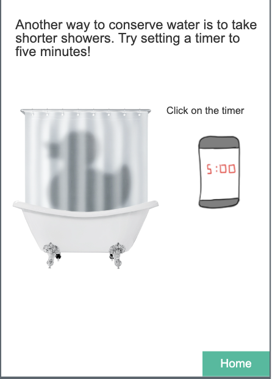
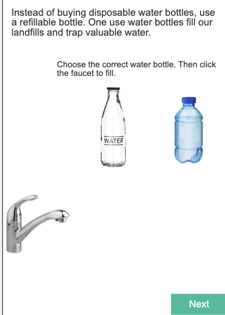
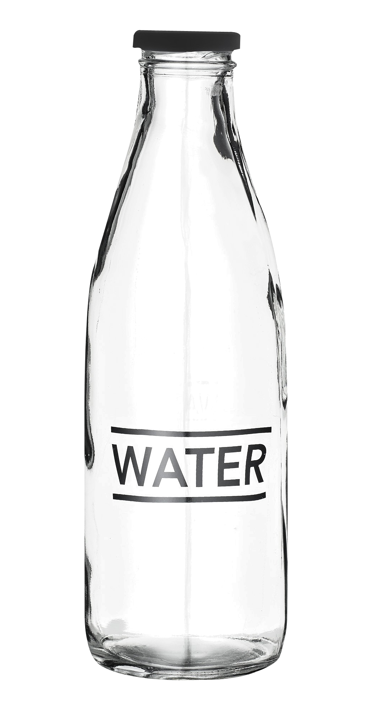

# Bootstrap Layouts and Grid System

## 📚 **Previous Lesson**

Coming from **[Lesson 2: Bootstrap Framework](../lesson-2-bootstrap-framework/lesson-2-bootstrap-framework.md)**? Great! Now you'll learn how to use Bootstrap's grid system to create responsive layouts.

---

## Step 1: Understanding Bootstrap Grid

Bootstrap's grid system is the foundation of responsive layouts. It uses a 12-column system that automatically adapts to different screen sizes.

### 🚀 **Key Grid Concepts:**
- **Container**: Wraps your content and provides responsive margins
- **Row**: Horizontal group that contains columns
- **Column**: Vertical content areas that stack on mobile and align on larger screens
- **Breakpoints**: Screen size thresholds where layouts change (xs, sm, md, lg, xl)

---

## Step 2: Learn Bootstrap Grid and Cards

Visit these links on W3 Schools. Read or skim the lessons. Click on the TRY IT YOURSELF button to see examples of the code.

After you finish, answer the questions in your group.

For this section, you will not use VSCode. Just use the TRY IT YOURSELF button. Be sure to make some changes to the code if you are curious as to what things do. Don't be afraid to break the code, it will revert back if you refresh!

## Day 2: Bootstrap Layouts and Grid System

Visit these site links. Click on TRY IT YOURSELF. Get a general understanding of how it works. Then answer the questions at the end with your group.

1. [Bootstrap Grid System](https://www.w3schools.com/bootstrap5/bootstrap_grid_basic.php)
2. [Bootstrap Cards](https://www.w3schools.com/bootstrap5/bootstrap_cards.php)

## Questions for Day 2

### For #1 Bootstrap Grid System

1. What are "row" and "col"? Which is the parent, which is the child?
2. Why might you use `bg-primary` or `bg-dark` with `col`?

### For #2 Bootstrap Cards

1. Cards can be simple or complex. Name a few essential classes you will need to build your own cards.
2. Name a few nice-to-have classes you might use in your projects.

---

## Step 3: Complete the App Prototype

### Try it! (Mini-Project)

Now you have all the tools you need to complete the other 2 pages of the Water Conservation App. Use Bootstrap's grid system (row and col) to create responsive layouts for the additional pages.

**Hint**: Use `row` and `col` classes to get the effect of a grid for the layouts of the other two pages.

To get started with a project, you may refer to the [start a project skill guide](../../../resources/skill-guides/start-project.md).

Remember to add and commit after each successful milestone. See the [git snippets](../../../resources/git-snippets.md) for useful commands.

You may work on this together, but it is not a group project. Each individual should have their own git repository and code. 

**If you finish early**, as a challenge, you may work on your own project with your own idea using Bootstrap's grid system.

## Assets

