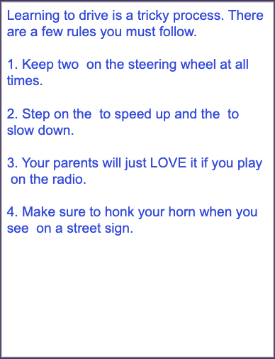

# Bootstrap Grid and Input Forms

## 📚 **Previous Lesson**

Coming from **[Lesson 3: Bootstrap Layouts and Grid System](../lesson-3-bootstrap-layout/lesson-3-bootstrap-layout.md)**? Excellent! Now you'll learn how to create interactive forms and use Bootstrap's utility classes to enhance your layouts.

---

## Understanding Bootstrap Utilities (Preview)

Bootstrap utilities are helper classes that make it easy to add common styling without writing custom CSS. They cover spacing, colors, borders, shadows, and more.

### 🚀 **Key Utility Concepts:**
- **[Spacing Utilities](https://getbootstrap.com/docs/5.2/utilities/spacing/)**: `m-*` (margin), `p-*` (padding) for consistent spacing
- **[Color Utilities](https://getbootstrap.com/docs/5.2/utilities/colors/)**: `text-*`, `bg-*` for text and background colors
- **[Border Utilities](https://getbootstrap.com/docs/5.2/utilities/borders/)**: `border`, `border-*` for adding and styling borders
- **[Display Utilities](https://getbootstrap.com/docs/5.2/utilities/display/)**: `d-flex`, `d-block`, `d-inline` for controlling element visibility and layout
- **[Hidden Elements](https://getbootstrap.com/docs/5.2/utilities/display/#hiding-elements)**: use `d-none` to hide an element. 
- **[Flexbox Utilities](https://getbootstrap.com/docs/5.2/utilities/flex/)**: `d-flex`, `justify-content-*`, `align-items-*` for flexible layouts

---

## Bootstrap Utilities and Forms (Preview)

Bootstrap provides powerful utility classes and form components that make building interactive interfaces simple and consistent.


### 📝 **Form Components:**
- **[Form Controls](https://getbootstrap.com/docs/5.2/forms/form-control/)**: `form-control` and (`form-select` for inputs and dropdowns)
- **[Form Layout](https://getbootstrap.com/docs/5.2/forms/layout/)**: `row`, `col` for responsive form grids
- **[Form Validation](https://getbootstrap.com/docs/5.2/forms/validation/)**: `is-valid`, `is-invalid` for visual feedback
- **[Form Groups](https://getbootstrap.com/docs/5.2/forms/layout/#form-groups)**: `form-group` for organizing related inputs
- **[Custom Controls](https://getbootstrap.com/docs/5.2/forms/checks-radios/)**: `form-check`, `form-switch` for checkboxes and toggles

Most importantly, you will need the class .form-control and set the attribute `type=`. (For example `type=text` or `type=checkbox`)

### 🔧 **Quick Example:**
```html
<!-- Spacing utilities -->
<div class="m-3 p-2">Content with margin and padding</div>

<!-- Form with grid layout -->
<form class="row g-3">
  <div class="col-md-6">
    <input type="text" class="form-control" placeholder="First Name">
  </div>
  <div class="col-md-6">
    <input type="text" class="form-control" placeholder="Last Name">
  </div>
</form>
```

---

##  W3 School Documentation

Visit these links on W3 Schools. Read or skim the lessons. Click on the TRY IT YOURSELF button to see examples of the code.

After you finish, answer the questions in your group.

For this section, you will not use VSCode. Just use the TRY IT YOURSELF button. Be sure to make some changes to the code if you are curious as to what things do. Don't be afraid to break the code, it will revert back if you refresh!

Visit these site links. Click on TRY IT YOURSELF. Get a general understanding of how it works. Then answer the questions at the end with your group.

1. [Bootstrap Utilities](https://www.w3schools.com/bootstrap5/bootstrap_utilities.php)
2. [Bootstrap Forms](https://www.w3schools.com/bootstrap5/bootstrap_forms.php)
3. [Bootstrap Form Check/Radio](https://www.w3schools.com/bootstrap5/bootstrap_form_check_radio.php)

Note: You may also visit [getBootstrap.com](https://getBootstrap.com) for more on these concepts.

## Questions for the Day

### For #1 Bootstrap Utilities

1. What are the main categories of Bootstrap utilities? Give examples of each.
2. How do spacing utilities work? What does `m-3` and `p-2` mean?

### For #2 Bootstrap Forms

1. What are the key Bootstrap classes for styling forms? Name at least 3.
2. How do you make a form responsive using Bootstrap classes?

### For #3 Bootstrap Form Check/Radio

1. What's the difference between checkboxes and radio buttons? When would you use each?
2. How do you create a custom-styled checkbox or radio button with Bootstrap?

---

### Try it! (Mini-Project)

Now you have all the tools you need to create two interactive games using Bootstrap's grid system and form components:

**Requirements:**
- Use Bootstrap's grid system (`row` and `col`) to display color swatches
- Use your own stylesheet to the specific colors.

#### 📝 **Mad Libs Game**
Create a Mad Libs-style word game where users fill in blanks to create funny stories. 

1. First, play the Mad Libs Game [here on code.org](https://studio.code.org/courses/csp5-virtual/units/1/lessons/7/levels/1)
2. Next, to get started with a project, you may refer to the [start a project skill guide](../../../resources/skill-guides/start-project.md). Call your project `mad-libs-game`
3. Remember to add and commit after each successful milestone. See the [git snippets](../../../resources/git-snippets.md) for useful commands.

You may work on this together, but it is not a group project. Each individual should have their own git repository and code. 

**If you finish early**, as a challenge, you may work on your own project idea using Bootstrap utilities and forms. For example, you might make a mockup for a login screen. Or an address form for a shopping app.

## Assets

Screen 1


Screen 2



---

## 📚 **Next Lesson**

Ready to collaborate on a group project? Continue to **[Lesson 5: CSS Grid Group Project](../lesson-5-css-grid-group-project/lesson-5-css-grid-group-project.md)** to build the Color Sleuth game with your team using Bootstrap's grid system!
