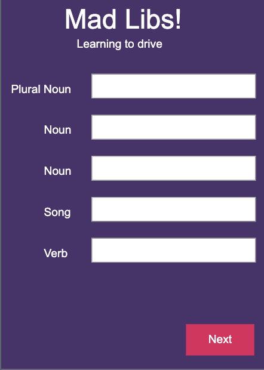

# Bootstrap Grid and Input Forms

## 📚 **Previous Lesson**

Coming from **[Lesson 3: Bootstrap Layouts and Grid System](../lesson-3-bootstrap-layout/lesson-3-bootstrap-layout.md)**? Excellent! Now you'll learn how to create interactive forms and use Bootstrap's utility classes to enhance your layouts.

---

## Step 1: Understanding Bootstrap Utilities

Bootstrap utilities are helper classes that make it easy to add common styling without writing custom CSS. They cover spacing, colors, borders, shadows, and more.

### 🚀 **Key Utility Concepts:**
- **Spacing Utilities**: `m-*` (margin), `p-*` (padding) for consistent spacing
- **Color Utilities**: `text-*`, `bg-*` for text and background colors
- **Border Utilities**: `border`, `border-*` for adding and styling borders
- **Display Utilities**: `d-*` for controlling element visibility and layout
- **Flexbox Utilities**: `d-flex`, `justify-content-*`, `align-items-*` for flexible layouts

---

## Step 2: Learn Bootstrap Utilities and Forms

Visit these links on W3 Schools. Read or skim the lessons. Click on the TRY IT YOURSELF button to see examples of the code.

After you finish, answer the questions in your group.

For this section, you will not use VSCode. Just use the TRY IT YOURSELF button. Be sure to make some changes to the code if you are curious as to what things do. Don't be afraid to break the code, it will revert back if you refresh!

## Day 3: Bootstrap Utilities and Forms

Visit these site links. Click on TRY IT YOURSELF. Get a general understanding of how it works. Then answer the questions at the end with your group.

1. [Bootstrap Utilities](https://www.w3schools.com/bootstrap5/bootstrap_utilities.php)
2. [Bootstrap Forms](https://www.w3schools.com/bootstrap5/bootstrap_forms.php)
3. [Bootstrap Form Check/Radio](https://www.w3schools.com/bootstrap5/bootstrap_form_check_radio.php)

## Questions for Day 3

### For #1 Bootstrap Utilities

1. What are the main categories of Bootstrap utilities? Give examples of each.
2. How do spacing utilities work? What does `m-3` and `p-2` mean?

### For #2 Bootstrap Forms

1. What are the key Bootstrap classes for styling forms? Name at least 3.
2. How do you make a form responsive using Bootstrap classes?

### For #3 Bootstrap Form Check/Radio

1. What's the difference between checkboxes and radio buttons? When would you use each?
2. How do you create a custom-styled checkbox or radio button with Bootstrap?

---

## Step 3: Create Interactive Games

### Try it! (Mini-Project)

Now you have all the tools you need to create two interactive games using Bootstrap's grid system and form components:

#### 🎮 **Game 1: Color Sleuth Game**
Create a game where users need to identify colors. Use Bootstrap's grid system to create a color palette and forms to capture user input.

**Requirements:**
- Use Bootstrap's grid system (`row` and `col`) to display color swatches
- Use your own stylesheet to the specific colors.

#### 📝 **Game 2: Mad Libs Game**
Create a Mad Libs-style word game where users fill in blanks to create funny stories.

To get started with a project, you may refer to the [start a project skill guide](../../../resources/skill-guides/start-project.md).

Remember to add and commit after each successful milestone. See the [git snippets](../../../resources/git-snippets.md) for useful commands.

You may work on this together, but it is not a group project. Each individual should have their own git repository and code. 

**If you finish early**, as a challenge, you may work on your own project idea using Bootstrap utilities and forms.

## Assets

