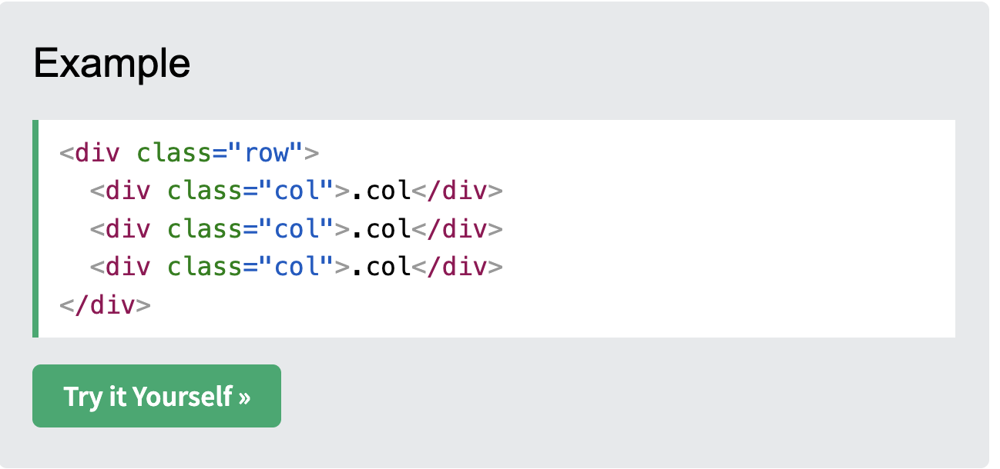
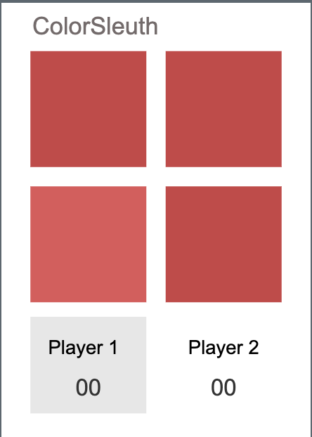
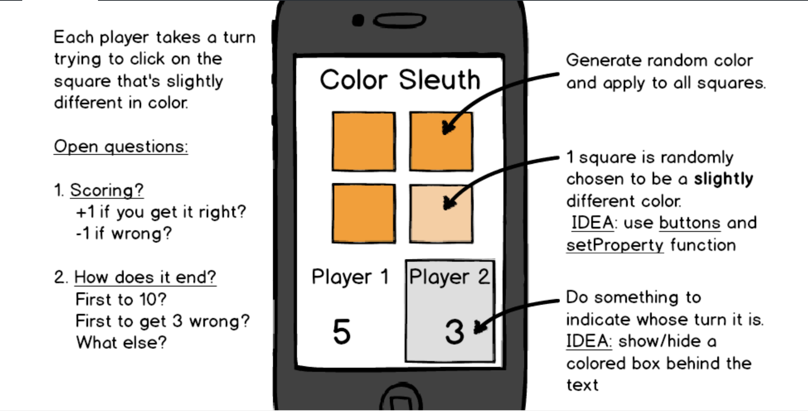

# 🎮 CSS Grid Group Project: Color Sleuth Game

## **Project Overview**

* **Who**: Groups of 2-4
* **Timeframe**: 1 hour
* **Topics**: Bootstrap, git, grid system, collaboration

**Level**: Intermediate  
**Tools**: VS Code, Git, Bootstrap  
**Goal**: Build a collaborative Color Sleuth game using Bootstrap's grid system and git collaboration

For this group project, you will need to re-create the Color Sleuth Game in HTML and CSS. You will need to use Bootstrap `row` and `col` classes. You will also need to create your own classes in `style.css` to ensure subtle differences in background color.

** Key Success Factor**: Divide up the work into small pieces and commit your work after each small victory. Work together and screenshare. Don't work separately for this one. You are all going to work on a single file, so take turns committing, pushing and pulling to avoid conflicts.

## 🚀 **Step 1: Explore and Plan**

1. **Review the Grid System Basics** on [w3schools](https://www.w3schools.com/bootstrap5/bootstrap_grid_basic.php)
2. **Study the Three Equal Columns Example**:
   
3. **Examine the Color Sleuth Game**:
   
   
4. **Play the Game**: Try a few rounds on [code.org](https://studio.code.org/courses/csp5-virtual/units/1/lessons/10/levels/1)
5. **Plan Your Elements**: Discuss what HTML elements you will need
6. **Start Building**: Begin working as a group!

## 🛠️ **Step 2: Build as a Team**

### **Collaboration Setup:**
1. Choose one person to create your repo. Call it `color-sleuth-game`
2. One person will go through the process of creating a project and setting it up on GitHub. Create an `index.html` file and a `style.css` file
3. Invite Collaborators to join
4. All group members will clone the repo to their local machine

### **Development Workflow:**
5. Take turns screen sharing and making updates to the Color Sleuth game. Work as a group. Do not make changes to your code unless you are the one screen sharing
6. After each turn, use `git pull` to get the latest change from your team member
7. Discuss your changes and your plans as you move along. Ask questions if you are not sure of what is happening
8. Repeat steps 5-7 until you complete the project

**Note**: You do not have to make the game interactive yet. Just make it LOOK LIKE the example. You don't have to have the behavior of the game working yet.

### Deliverable: 

When you complete your mini-project, submit your group project here... [https://docs.google.com/forms/d/e/1FAIpQLSeqj7n4R6aQOty1E1zn-9mR5i6ujPmFVKh2Fp-Rn2liDXfqPw/viewform?usp=dialog](https://docs.google.com/forms/d/e/1FAIpQLSeqj7n4R6aQOty1E1zn-9mR5i6ujPmFVKh2Fp-Rn2liDXfqPw/viewform?usp=dialog)

---

## 📚 **Back to Overview**

🎯 **Completed Week 4?** Return to the **[Week 4 CSS Frameworks Overview](../README.md)** to review your progress and see what you've accomplished!

**What you've learned this week:**
✅ CSS Frameworks and classless CSS  
✅ Bootstrap basics and components  
✅ Bootstrap grid system and layouts  
✅ Bootstrap utilities and forms  
✅ Collaborative development with git  

*Congratulations on completing the CSS Frameworks journey! 🚀*
