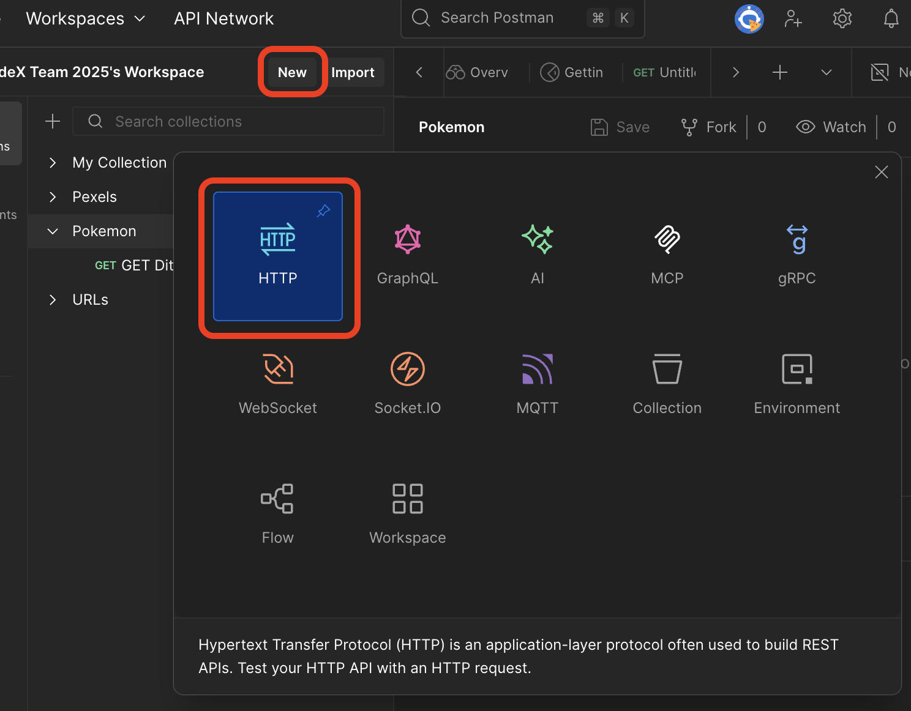

# 🧪 **Lesson: How Forms and URLs Work Together**

**Tags**: `#lesson` `#level2` `#forms`
**Goal**: Learn how forms create query strings and how websites use them to show results.
**Level**: Beginner web development
**Tools**: Any web browser and code editor (like VS Code or Code.org Web Lab)

**Turn in**: Create a repo called `my-search-params` on GitHub and check off Lesson 1 in your Moodle Classroom.

---

## 📱 **What You'll Learn to Build**


*Above: Example of a successful API response in Postman showing the title and data structure*

---

## ✅ Step 1: Guess What the URL Will Do

Look at these real web addresses (URLs). Try to guess what each one will do.

Then copy and paste each one into your browser and check.

| Site    | URL                                                             |
| ------- | --------------------------------------------------------------- |
| Google  | `https://www.google.com/search?q=funny+cat+videos`              |
| YouTube | `https://www.youtube.com/results?search_query=lofi+study+music` |
| WikiHow | `https://www.wikihow.com/wikiHowTo?search=boil+an+egg`          |

**What do you notice?**

The code after the `&` is called the Search Parameter. What is the format of a Search Parameter? 

* What part of the URL changes when you search?
* What does `q=` or `search_query=` mean?
* **What does the `+` symbol mean in the query?**

**✏️ Explore**

* Edit the text after `q=` to see if you can search for dog videos instead of cat videos.

---

## 🖼️ **Postman Workspace Overview**


*Above: The Postman workspace showing how to create a new request for testing APIs*

---

## ✅ Step 2: Make a YouTube Search Form

Now try making your own form to search YouTube.

Create a new GitHub repo called `my-search-params`.

Copy this into your HTML file:

```html
<form action="https://www.youtube.com/results" method="GET">
  <label for="search">Search YouTube:</label>
  <input type="text" name="search_query" id="search">
  <button type="submit">Search</button>
</form>
```

### Try it!

You may try it here, first.

<div>
  <form action="https://www.youtube.com/results" method="GET">
    <label for="search">Search YouTube:</label>
    <input type="text" name="search_query" id="search">
    <button type="submit">Search</button>
  </form>
</div>



*Above: How to create a new request in Postman for testing your forms*


#### More

**Try it out!** Type something and hit “Search.” What does the browser do with your input? **Hint:** look at the url bar at the top of your browser.

**Exploration** Notice the following attributes on your form. Try changing them to something else and changing them back to see what happens.

* The `type` attribute on the `button`. 
* The `action` attribute of the `form`.
* The `name` attribute on the `input`.

---

## ✅ Step 3: More Search Forms

Try a few of these on your page.

### 🎯 Google Search Form

```html
<form action="https://www.google.com/search">
  <label for="gsearch">Search Google:</label>
  <input type="text" name="q" id="gsearch">
  <button type="submit">Search</button>
</form>
```


*Above: Setting up search parameters in Postman for Google search*

### 🎯 WikiHow Search Form


```html
<form action="https://www.wikihow.com/wikiHowTo">
  <label for="wikihow">Search WikiHow:</label>
  <input type="text" name="search" id="wikihow">
  <button type="submit">Search</button>
</form>
```

### ✨ Challenge: DuckDuckGo

Use this link pattern:
`https://duckduckgo.com/?q=your+search+here`

**Can you create your own DuckDuckGo form?**


*Above: Setting up search parameters in Postman for DuckDuckGo*

### ✨ Challenge: bing.com

Go to `https://bing.com`. Explore the URL format. Can you create your own form for it?

---

## ✅ Step 4: Look at a Pexels Image URL

Try this link by copy-pasting it into your browser:

```
https://images.pexels.com/photos/3184402/pexels-photo-3184402.jpeg?w=600&h=400&sepia=80
```

**✏️ What do you think each part does?**

Try changing:

* `w=600` → `w=1000`
* `sepia=80` → `sepia=0`

What happens?

---

## ✅ Step 5: Build a Pexels Image Viewer Form

Here’s a form that lets you control the image size and filter:

Copy this into an HTML file, add bootstrap classes for your [form](https://getbootstrap.com/docs/5.3/forms/overview/#overview) and [button](https://getbootstrap.com/docs/5.3/components/buttons/#variants), and try it out.

```html
<form action="https://images.pexels.com/photos/3184402/pexels-photo-3184402.jpeg" method="GET">
  <label for="w">Width:</label>
  <input type="number" name="w" id="w" value="600">

  <label for="h">Height:</label>
  <input type="number" name="h" id="h" value="400">

  <label for="sepia">Sepia (0–100):</label>
  <input type="text" name="sepia" id="sepia" value="80">

  <button type="submit">View Image</button>
</form>
```

✏️ Try editing this form to include one or more options listed below.

---

## 📘 Pexels Image Options (Documentation)

Here are some options you can add to the query string in the URL or as input fields in your form:

| Option  | What it does                                          |
| ------- | ----------------------------------------------------- |
| `w`     | Width of the image in pixels                          |
| `h`     | Height of the image in pixels                         |
| `sepia` | Sepia filter level (0–100)                            |
| `blur`  | Blur amount (0–100)                                   |
| `face-blur` | Blur face (1-100)                                 |
| `fit`   | Resize style (`crop`, `clip`, etc.)                   |
| `pad`   | How much padding to have around the image in px       |
| `bg`    | Background color in hex (e.g., `bg=ffffff` for white) |

**Note** There are more options for Pexels [here](https://docs.imgix.com/en-US/apis/rendering/size/image-height).

---

## 🌤️ **API Response Example**


*Above: Example of an API response showing JSON data structure*

---

### 💡 Optional Activity

Add new fields to the Pexels form to test:

* blur level
* fit option
* background color

Example field:

```html
<label for="blur">Blur (0–100):</label>
<input type="number" name="blur" id="blur" value="20">
```

---

## 🧪 Final Challenges

### 🔍 Challenge 1: Search Openverse

Free images and audio. Try:

```
https://openverse.org/search/?q=mountains
```

Make your own form like this:

```html
<form action="https://openverse.org/search/">
  <label for="term">Search Openverse:</label>
  <input type="text" name="q" id="term">
  <button>Search</button>
</form>
```

---

### 🌏 Challenge 2: Google Translate a Word

Use this format:

```
https://translate.google.com/?sl=en&tl=zh-TW&text=hello&op=translate
```

Build a form that lets the user enter a word in English and opens the translation in Traditional Chinese.

---

### 🍝 Challenge 3: AllRecipes Search

Use this format:

```
https://www.allrecipes.com/search/results/?wt=pasta
```

Make a form that lets the user search for recipes by ingredient or dish name.


*Above: Setting up search parameters in Postman for AllRecipes*

---

## ✅ Wrap-Up

You learned:

* How form input appears in the URL using query strings
* That `+` means a space in most query strings
* How to search real sites with forms
* How to experiment with image URLs to change what’s shown

✅ Great work!

---

## 🔗 **Navigation**

- [← Back to Week 6 Overview](README.md)
- [Next: Lesson 2 - How to Use Postman →](lesson-2-postman.md)
