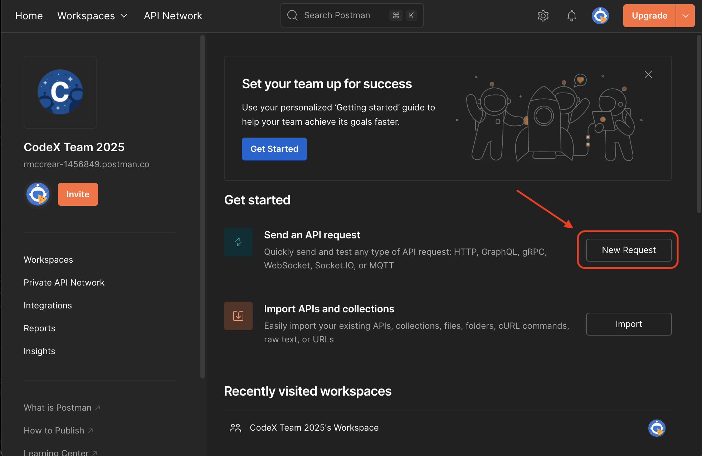
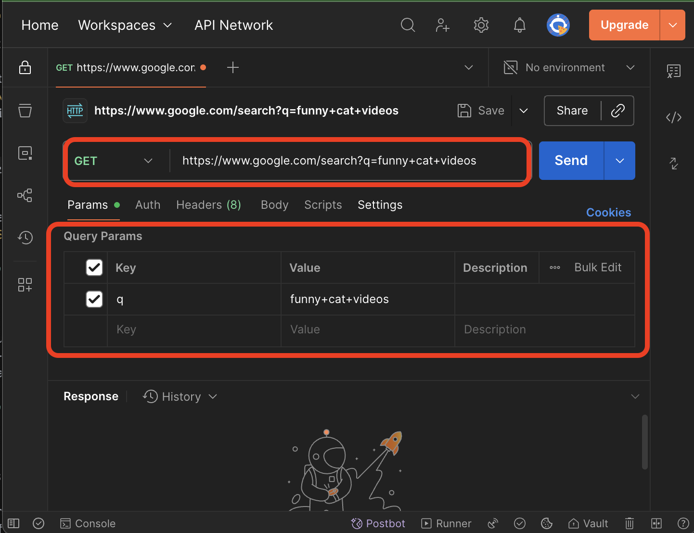
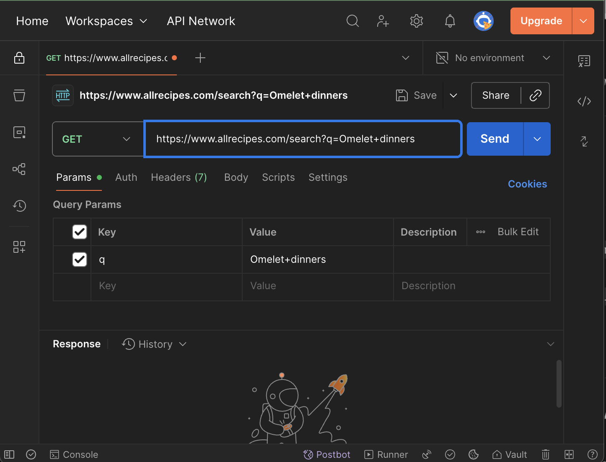
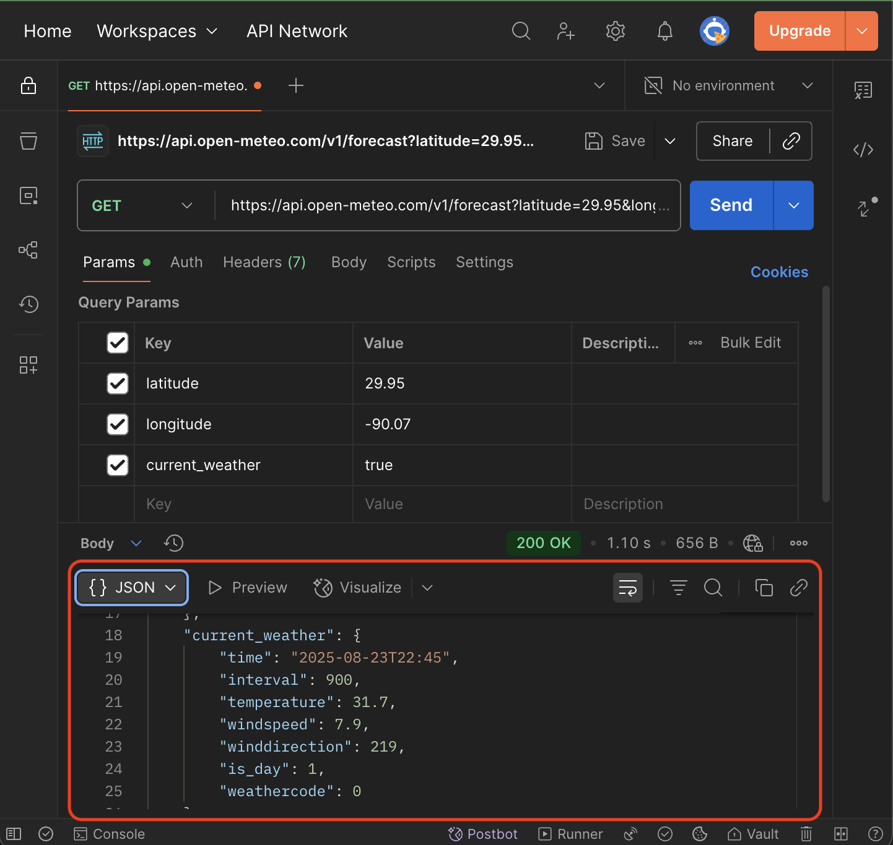
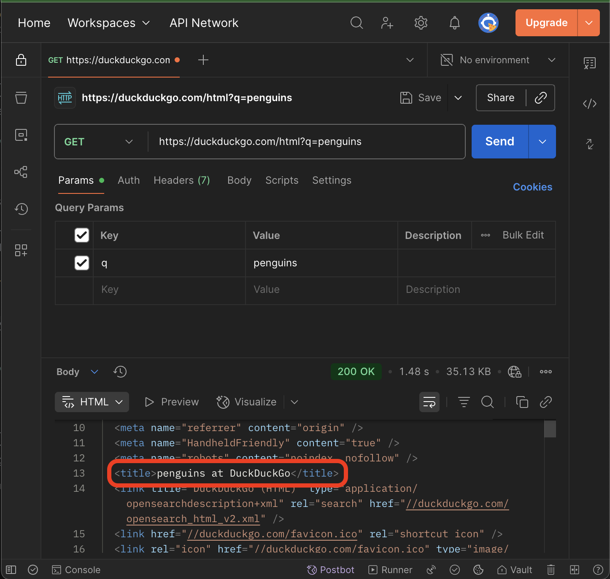

# 🧪 **Lesson 2: How to Use Postman**

**Tags**: `#lesson` `#level2` `#postman`
**Goal**: Explore query strings in Postman, compare HTML vs JSON responses, and practice using the Params tab.
**Level**: Beginner web development
**Tools**: Postman app or [Postman Web](https://www.postman.com/)

---

## ✅ Step 1: What is Postman?

Postman is a tool developers use to test APIs. Instead of typing a URL in the browser, you can send requests from Postman and see:

* **Status code** (200 OK, 404 Not Found, etc.)
* **Headers** (metadata about the response)
* **Body** (HTML or JSON text)

👉 Think of Postman as a **microscope for the internet**.



*Above: The Postman workspace showing how to create a new request*

---

## ✅ Step 2: Google Search (HTML)

1. Open Postman.
2. Click **New → HTTP Request**.
3. Enter this URL:

```
https://www.google.com/search?q=funny+cat+videos
```

4. Make sure the method is **GET**.
5. Press **Send**.

**Using the Params tab**

| Key | Value      |
| --- | ---------- |
| q   | javascript |



*Above: Setting up search parameters in Postman for Google search*

Note: Google Search requires CSS and JavaScript to display full results. You will only be able to see the raw HTML in the response to Postman.


---

## ✅ Step 3: DuckDuckGo (Text-Only HTML)

DuckDuckGo has a **special HTML endpoint** that returns simple text-based results—perfect for Postman.

**Direct URL**

```
https://duckduckgo.com/html?q=penguins
```


*Above: Setting up search parameters in Postman for DuckDuckGo*

**Using the Params tab**

| Key | Value    |
| --- | -------- |
| q   | penguins |

Optional settings:

* Region: `kl=us-en`
* SafeSearch: `kp=1` (on), `kp=-1` (moderate), `kp=-2` (off)

---

## ✅ Step 4: Allrecipes (HTML Search)

Allrecipes also supports query params with `?q=`.

**Direct URL**

```
https://www.allrecipes.com/search?q=Omelet+dinners
```

**Using the Params tab**

| Key | Value          |
| --- | -------------- |
| q   | Omelet dinners |



*Above: Setting up search parameters in Postman for AllRecipes*

---

## ✅ Step 5: Open-Meteo (JSON, New Orleans)

Now let’s use an API that returns **JSON** (data, not HTML).

**Direct URL**

```
https://api.open-meteo.com/v1/forecast?latitude=29.95&longitude=-90.07&current_weather=true
```



*Above: Example of a weather API response showing JSON data structure*

**What you’ll see**

* Top-level fields: `latitude`, `longitude`
* Inside `current_weather`: `temperature`, `windspeed`, `weathercode`

Example (shortened):

```json
{
  "latitude": 29.95,
  "longitude": -90.07,
  "current_weather": {
    "temperature": 31.2,
    "windspeed": 4.5,
    "weathercode": 1
  }
}
```

---

## ✅ Step 6: Compare Responses

* **HTML pages** (Google, DuckDuckGo, Allrecipes): look for `<title>`, `<a>`, `<h3>`
* **JSON data** (Open-Meteo): curly braces `{}`, key/value pairs, easy for JavaScript



*Above: Example of a successful API response in Postman showing the title and data structure*

---

## ✅ Step 7: Save Weather Data to File

Now let's save the weather data you received from the Open-Meteo API to a file in your `my-search-params` repository.

1. **Copy the JSON response** from Postman (the entire response body)
2. **Create a new file** in your repository called `current-weather.json`
3. **Paste the JSON data** into this file
4. **Save the file** and commit it to your repository

**Example file structure:**
```
my-search-params/
├── index.html
├── current-weather.json  ← New file
└── README.md
```

**What to include in current-weather.json:**
- The complete JSON response from the Open-Meteo API
- Make sure to format it properly (Postman can help with this)
- Include the timestamp of when you made the request

**Git commands to add and commit:**
```bash
git add current-weather.json
git commit -m "Add current weather data from Open-Meteo API"
```

---

## ✨ Challenges

1. **DuckDuckGo tweak**
   Add `&kl=us-en` and `&kp=1`. What changes in results?

2. **Allrecipes remix**
   Change `q=Omelet dinners` → `q=vegetarian+omelet` → `q=omelet+for+kids`.

3. **Open-Meteo swap**
   Change the coordinates from New Orleans (`latitude=29.95&longitude=-90.07`) to Seattle (`latitude=47.6&longitude=-122.3`). Compare the `temperature` values.

---

### 🌍 Extra Challenge: Find Your Own Location’s Weather

1. Go to the [LocationIQ Demo Page](https://locationiq.com/demo).

2. Type in the name of a place (e.g. your school, a landmark, or your hometown).

3. Copy the **latitude and longitude** shown.

4. Plug them into the Open-Meteo URL:

   ```
   https://api.open-meteo.com/v1/forecast?latitude=[YOUR_LAT]&longitude=[YOUR_LON]&current_weather=true
   ```

5. Run the request in Postman.

6. **Save the weather data** to a new file in your repository:
   - Create a file named `current-weather-[CITY-NAME].json`
   - Replace `[CITY-NAME]` with the actual city name (use lowercase, no spaces)
   - Examples: `current-weather-atlanta.json`, `current-weather-seattle.json`, `current-weather-newyork.json`

**Repository structure after the challenge:**
```
my-search-params/
├── index.html
├── current-weather.json          ← New Orleans (from Step 7)
├── current-weather-atlanta.json ← Atlanta weather data
├── current-weather-seattle.json ← Seattle weather data
├── current-weather-[city].json  ← Your chosen city
└── README.md
```

**Note**: Make sure you're working in the `my-search-params` repository you created in Lesson 1.

**Git workflow for each new city:**
```bash
git add current-weather-[city].json
git commit -m "Add weather data for [City Name]"
```

**Report back:**

* Place name
* Coordinates
* Current temperature
* Filename you created

---

## ✅ Wrap-Up

You learned how to:

* Send GET requests in Postman
* Add query params via the **Params tab**
* Compare HTML vs JSON responses
* Use real coordinates to fetch live weather data

---

## 🔗 **Navigation**

- [← Back to Week 6 Overview](README.md)
- [← Previous: Lesson 1 - Search Parameters](lesson-1-search-params.md)
- [Next: Lesson 3 - Build a Weather App →](lesson-3-weather-app.md)

👉 Next Lesson: Use **Postman’s Code Generation** to turn these requests into **JavaScript `fetch()`** calls.
