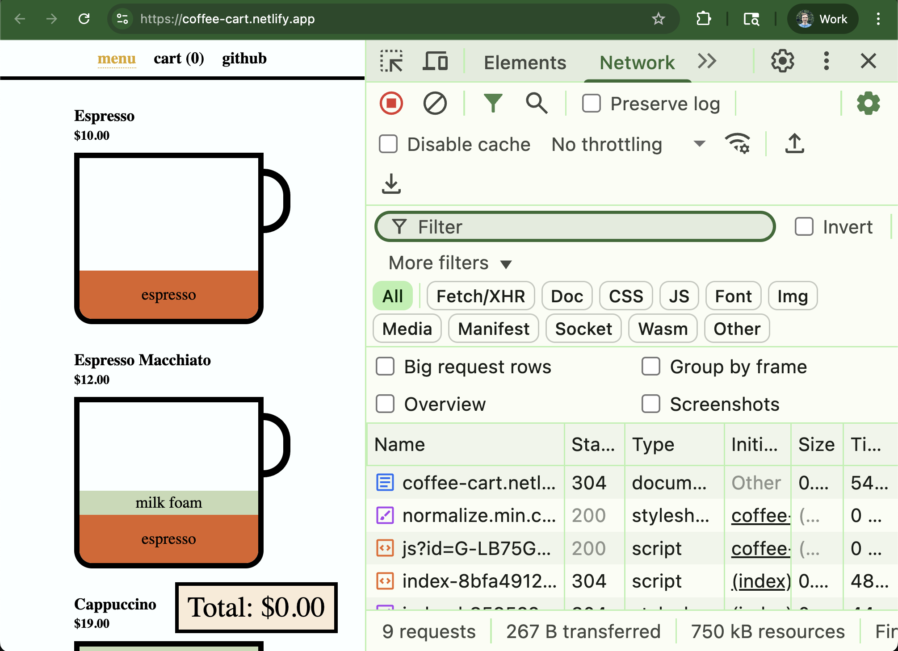
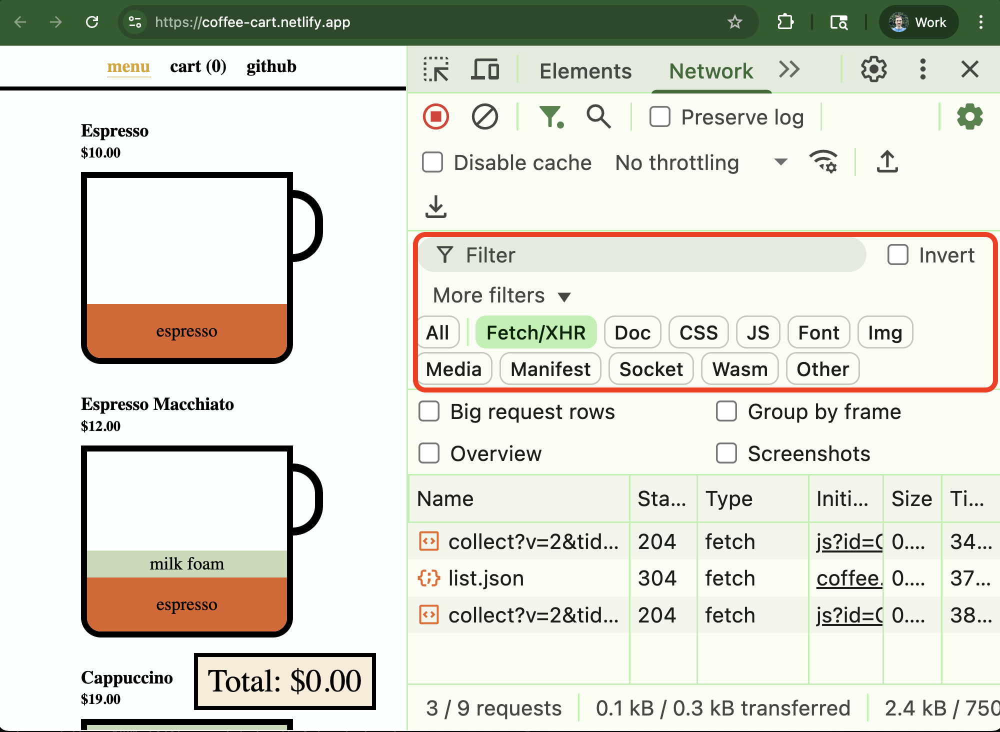
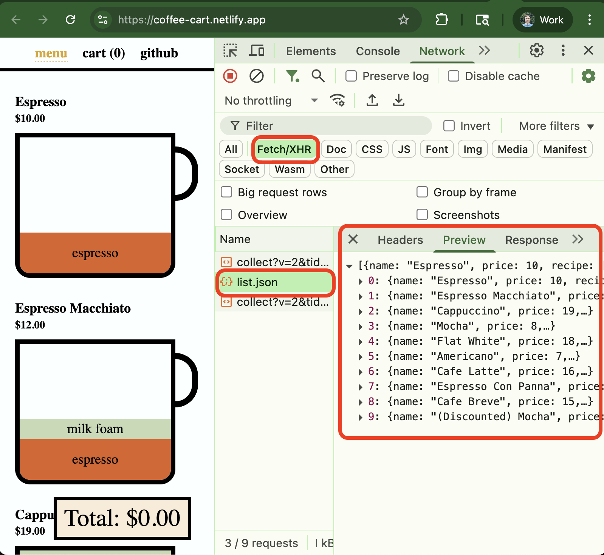
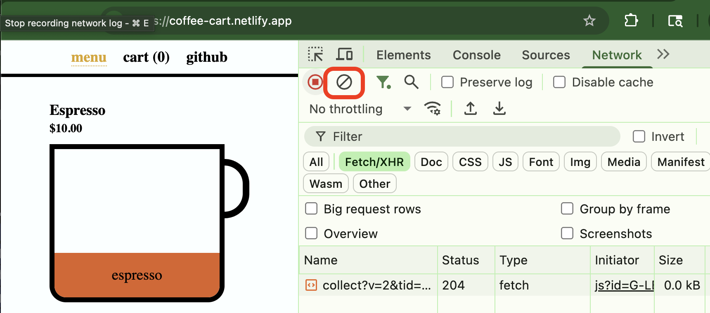
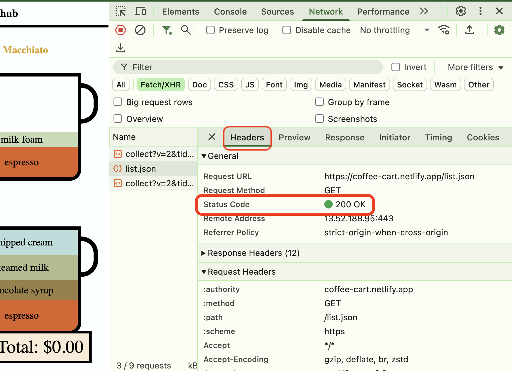
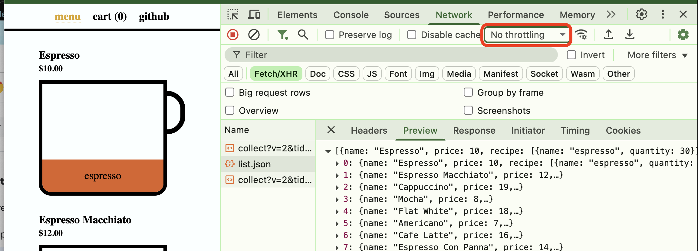
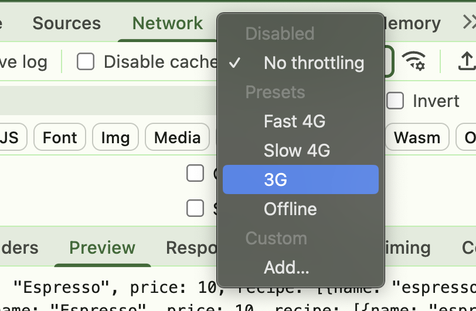
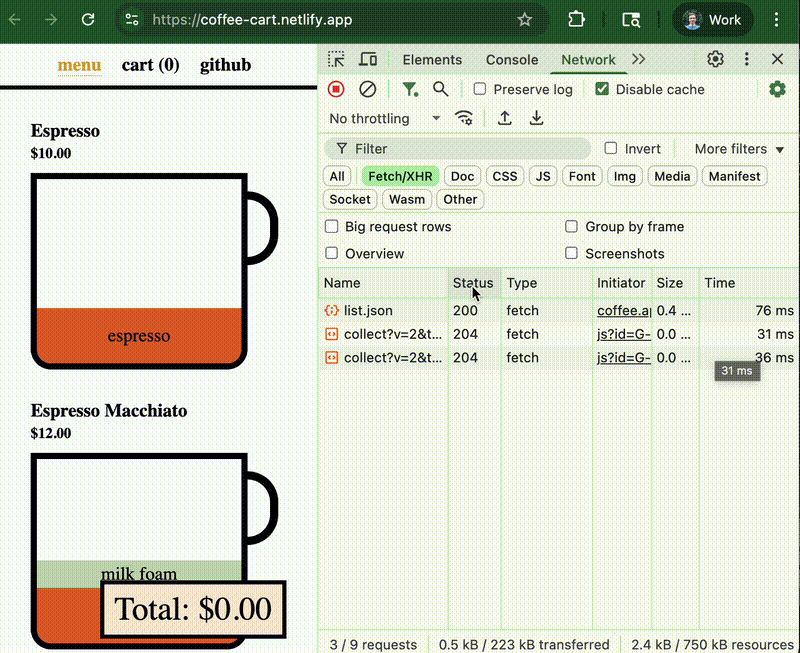

# ☕ Lesson 4 — The Network Tab (Coffee Shop Demo)

**Tags**: `#lesson` `#level2` `#devtools`
**Goal**: Learn to use the Network tab to see requests and responses in action.
**Tools**: Chrome DevTools (Network tab), [Coffee Cart Demo](https://coffee-cart.netlify.app/)

🔗 Source Material: [Chrome DevTools — Network Tab Overview](https://developer.chrome.com/docs/devtools/network/overview)

---

### Step 1 — Open the Network Panel

* Open the [Coffee Cart Demo](https://coffee-cart.netlify.app/). or at https://coffee-cart.app/
* Right-click → **Inspect** to open DevTools.
* Click the **Network** tab.
* Alteratively, Press CTRL+SHIFT+P and type Network.
* Reload the page ( ⟳ ) to see requests stream in.

📖 Docs: [Open the Network panel](https://developer.chrome.com/docs/devtools/network/overview#open_the_network_panel)
📸 Screenshot:

---

### Step 2 — Use Filters

The Network panel shows everything (HTML, CSS, images, scripts). Use filters at the top to reduce clutter:

* **Doc** → HTML documents
* **JS** → JavaScript files
* **Img** → Images like coffee photos
* **XHR/Fetch** → Data requests (APIs, JSON)

👉 Try filtering to **XHR** to see the `coffee.json` request.

📖 Docs: [Filter requests](https://developer.chrome.com/docs/devtools/network/reference?hl=en#filter-by-type)
📸 Screenshot:

---

### Step 3 — Inspect a Request

Click the `list.json` row. Check the right-hand tabs:

Note: Reload the page if it does not appear.

* **Headers** → shows method (GET), URL, query string parameters
* **Preview** → formatted JSON menu data
* **Response** → raw JSON text

📖 Docs: [Inspect requests](https://developer.chrome.com/docs/devtools/network/overview#inspect)
📸 Screenshot:

---

### Step 4 — Clear and Reload

Use the clear button to reset the panel, then reload. Watch the same requests appear fresh.

📖 Docs: [Clear requests](https://developer.chrome.com/docs/devtools/network/reference#clear)
📸 Screenshot:

---

### Step 5 — Check HTTP Headers 

Inspect `coffee.json` again:

Inspect coffee.json in Network → Headers. Headers are metadata that describe the request and response:

* General: URL, method (GET/POST), status code, and remote server.
* Request Headers: info sent by the browser (e.g., Accept, User-Agent, Origin, Authorization).
* Response Headers: info from the server (e.g., Content-Type, caching, cookies, CORS, security policies).
* Query String Parameters: key/value pairs in the URL after ?, often for filters or cache-busting. (Not on the coffee app, but it will be in other apps.)

📖 Docs: [View headers](https://developer.chrome.com/docs/devtools/network/reference?hl=en#headers)
📸 Screenshot:

---

### Step 6 — Advanced Features

* **Throttle the network**: simulate slower connections (Fast 3G, Slow 3G).
  📖 Docs: [Throttle requests](https://developer.chrome.com/docs/devtools/network/reference?hl=en#throttling)
  📸 Screenshot:
  

  

* **Filter images**: see only the coffee photos.
  📖 Docs: [Filter by resource type](https://developer.chrome.com/docs/devtools/network/reference?hl=en#filter-by-type)
  📸 Official screenshot:
  

* **Replay requests with fetch in the console**: manually trigger the same network request from the browser console.

  👉 Try this with the `list.json` request to see how you can programmatically make the same API call.

  1. **Right-click** on the `list.json` request row
  2. **Select** Copy → Copy as Fetch
  3. **Press Esc** to open a second DevTools tab
  4. **Click Console** in the second tab
  5. **Paste** the copied fetch request and press Enter
  6. **Inspect** the new request that appears in the Network tab

  📖 Docs: [Copy requests](https://developer.chrome.com/docs/devtools/network/reference?hl=en#copy)
  📸 Screenshot:
  

---

### Wrap-Up

In this official Coffee Shop demo, you learned how to:

* Open the Network tab
* Filter requests by type
* Inspect headers, responses, and query parameters
* Clear and reload requests
* Use throttling to simulate slower connections
* Replay requests programmatically from the console

🔗 Full guide: [Network Tab Overview (Chrome Docs)](https://developer.chrome.com/docs/devtools/network/overview)

---

👉 Next: You’ll apply this exact process in **Lesson 4**, where each city button in your local-weather project will trigger a request you can inspect in the Network tab, just like `coffee.json`.

---
