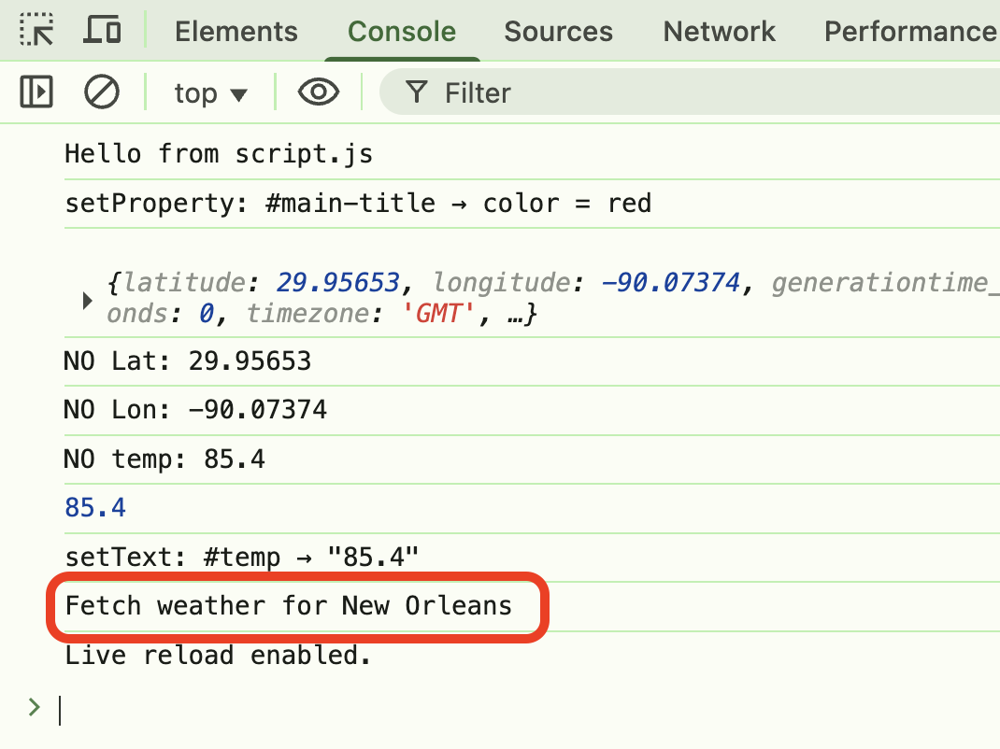

Level Navigation: **Current Level:** 1 | [2](./lesson-5-postman-code-gen-lv2.md) | [3](./lesson-5-postman-code-gen-lv3.md) | [4](./lesson-5-postman-code-gen-lv4.md) | [5](./lesson-5-postman-code-gen-lv5.md) | [6](./lesson-5-postman-code-gen-lv6.md)

---

# 🧪 Lesson 5 — Postman Code Generation (Level 1)

**Tags:** `#lesson` `#level1` `#postman` `#javascript`
**Goal:** Set up your project and create your first weather function with basic console logging.

---

## Overview

In this lesson, you will use your repo from lesson 3. 

**Postman Code Generation** is a powerful feature that automatically converts your API requests into working code snippets. When you click the "Code" button in Postman, it generates ready-to-use JavaScript, Python, or other language code that you can copy and paste directly into your projects.

Instead of having loose API code scattered throughout our script, we'll create clean, named functions like `fetchNewOrleansWeather()` that contain all the Postman-generated fetch logic. You'll first create the function, then immediately call the function to test it.

In this lesson, we will only be logging data to the console. We will update the actual webpage in the next lesson.

---

## Steps

### 1. Create `fetchNewOrleansWeather` function with console.log()

* In `script.js`, create a function called `fetchNewOrleansWeather`
* For now, just add `console.log("Weather for New Orleans")` inside the function

Show me:

<pre><code class="language-javascript">  function fetchNewOrleansWeather() {
    console.log("Weather for New Orleans");
  }</code></pre>

### 2. Immediately call it to test it in the console

* Open DevTools Console
* Type `fetchNewOrleansWeather()` and press Enter
* You should see your log message in the Console
* **Commit your changes to Git**

Show me:

<pre><code class="language-javascript">  function fetchNewOrleansWeather() {
    console.log("Fetch weather for New Orleans");
  }
  fetchNewOrleansWeather();</code></pre>

Show me:

> **💡 Need help with functions?** Check out our [JavaScript Reference](../../week5-event-driven-apps/js-reference.md) for function basics.

---

## ✅ Check Your Work

- [ ] Function `fetchNewOrleansWeather()` is created in script.js
- [ ] Function contains `console.log("Weather for New Orleans")`
- [ ] Function is called immediately after creation
- [ ] Console shows the log message when function is called
- [ ] Changes are committed to Git

---

## 🔗 Navigation

- [← Back to Main Lesson](../lesson-5-postman-code-gen.md)
- [Next: Level 2 - Add Button Challenge →](lesson-5-postman-code-gen-lv2.md)

---

**Ready for the next level? Continue to [Level 2: Add Button Challenge](lesson-5-postman-code-gen-lv2.md)**

---

Level Navigation: **Current Level:** 1 | [2](./lesson-5-postman-code-gen-lv2.md) | [3](./lesson-5-postman-code-gen-lv3.md) | [4](./lesson-5-postman-code-gen-lv4.md) | [5](./lesson-5-postman-code-gen-lv5.md) | [6](./lesson-5-postman-code-gen-lv6.md)
