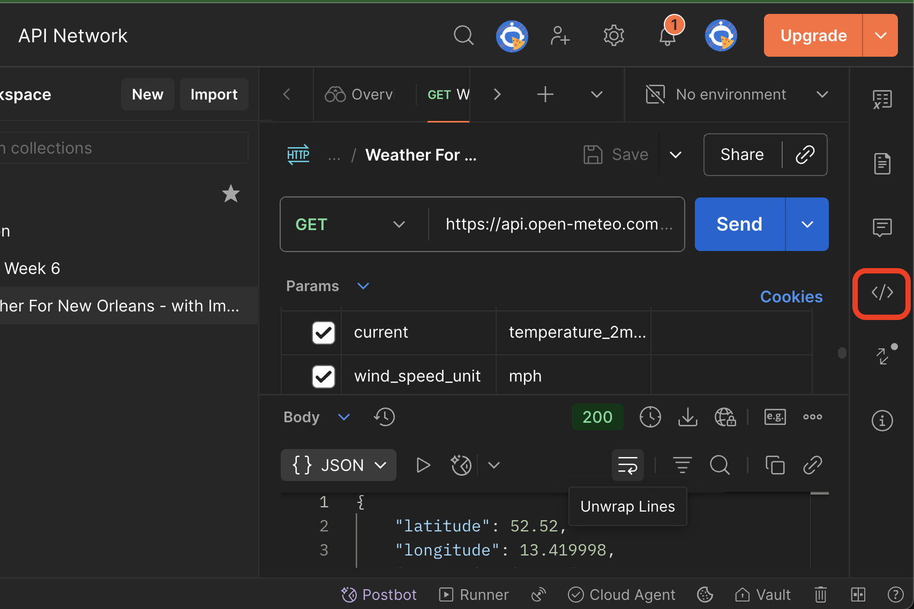
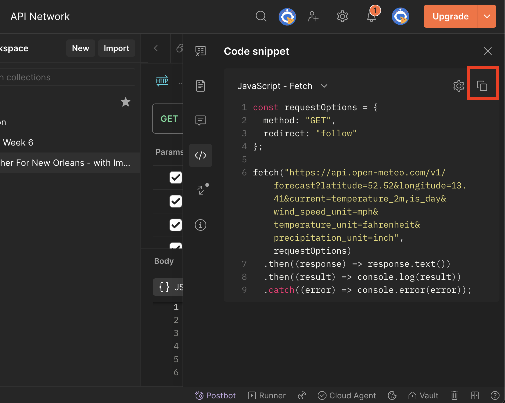

Level Navigation: [1](./lesson-5-postman-code-gen-lv1.md) | [2](./lesson-5-postman-code-gen-lv2.md) | **Current Level:** 3 | [4](./lesson-5-postman-code-gen-lv4.md) | [5](./lesson-5-postman-code-gen-lv5.md) | [6](./lesson-5-postman-code-gen-lv6.md)

---

# 🧪 Lesson 5 — Postman Code Generation (Level 3)

**Tags:** `#lesson` `#level3` `#postman` `#javascript` `#api`
**Goal:** Generate real API code from Postman and integrate it into your function.

---

## Overview

Now it's time to get real weather data! You'll use Postman's code generation feature to create actual API calls that fetch live weather information.

---

## Steps

### 4. Code gen from Postman and paste into `fetchNewOrleansWeather`

* In Postman, open Open-Meteo request for **New Orleans**
  * `latitude=29.95&longitude=-90.07&current_weather=true`
* Click **Code (\</>) → JavaScript — Fetch**
* **Copy the entire snippet** (fetch + then/catch)
* **Paste it inside your `fetchNewOrleansWeather` function**, replacing the console.log
* **Test immediately:**
  * In Console, call `fetchNewOrleansWeather()` → verify JSON response
  * **Network** shows a GET request to `api.open-meteo.com` on each call
  * **Console** shows the weather data
* **Commit your changes to Git**

Show me:

Show me:

> **💡 Understanding `.then()` and promises?** See our [Promise Reference Guide](../promise-reference.md) for detailed explanations.

---

## ✅ Check Your Work

- [ ] Postman request is set up with correct coordinates
- [ ] Code is generated using JavaScript → Fetch option
- [ ] Generated code is pasted into your function
- [ ] Function call shows JSON response in console
- [ ] Network tab shows API request to open-meteo.com
- [ ] Changes are committed to Git

---

## 🔗 Navigation

- [← Back to Main Lesson](../lesson-5-postman-code-gen.md)
- [← Previous: Level 2 - Button Challenge](lesson-5-postman-code-gen-lv2.md)
- [Next: Level 4 - Network Testing →](lesson-5-postman-code-gen-lv4.md)

---

**Ready for the next level? Continue to [Level 4: Network Testing](lesson-5-postman-code-gen-lv4.md)**

---

Level Navigation: [1](./lesson-5-postman-code-gen-lv1.md) | [2](./lesson-5-postman-code-gen-lv2.md) | **Current Level:** 3 | [4](./lesson-5-postman-code-gen-lv4.md) | [5](./lesson-5-postman-code-gen-lv5.md) | [6](./lesson-5-postman-code-gen-lv6.md)
