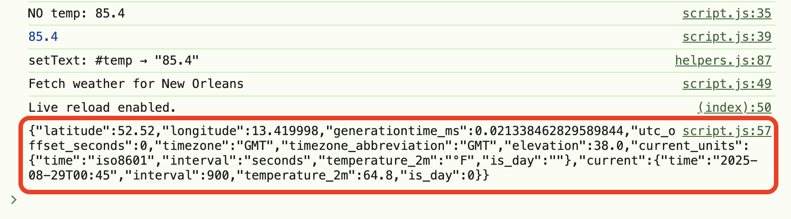
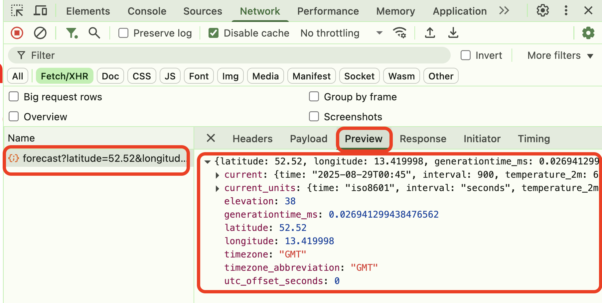

Level Navigation: [1](./lesson-5-postman-code-gen-lv1.md) | [2](./lesson-5-postman-code-gen-lv2.md) | [3](./lesson-5-postman-code-gen-lv3.md) | **Current Level:** 4 | [5](./lesson-5-postman-code-gen-lv5.md) | [6](./lesson-5-postman-code-gen-lv6.md)

---

# 🧪 Lesson 5 — Postman Code Generation (Level 4)

**Tags:** `#lesson` `#level4` `#postman` `#javascript` `#network`
**Goal:** Test your API integration and verify network requests are working correctly.

---

## Overview

Now let's verify that your API integration is working properly by testing the network requests and console output.

---

## Steps

### 5. Reload the page and check the network tab and the console tab in dev tools

* Open DevTools → Network tab
* Refresh your browser page
* Verify you see the API request in Network tab
* Verify you see the weather data in Console tab

Show me:

Show me:

---

## ✅ Check Your Work

- [ ] DevTools Network tab is open
- [ ] Page is refreshed to trigger API call
- [ ] Network tab shows request to api.open-meteo.com
- [ ] Console tab shows JSON weather data response
- [ ] API request completes successfully (200 status)
- [ ] Weather data is displayed in console

---

## 🔗 Navigation

- [← Back to Main Lesson](../lesson-5-postman-code-gen.md)
- [← Previous: Level 3 - Postman Code Generation](lesson-5-postman-code-gen-lv3.md)
- [Next: Level 5 - Multiple Cities →](lesson-5-postman-code-gen-lv5.md)

---

**Ready for the next level? Continue to [Level 5: Multiple Cities](lesson-5-postman-code-gen-lv5.md)**

---

Level Navigation: [1](./lesson-5-postman-code-gen-lv1.md) | [2](./lesson-5-postman-code-gen-lv2.md) | [3](./lesson-5-postman-code-gen-lv3.md) | **Current Level:** 4 | [5](./lesson-5-postman-code-gen-lv5.md) | [6](./lesson-5-postman-code-gen-lv6.md)
