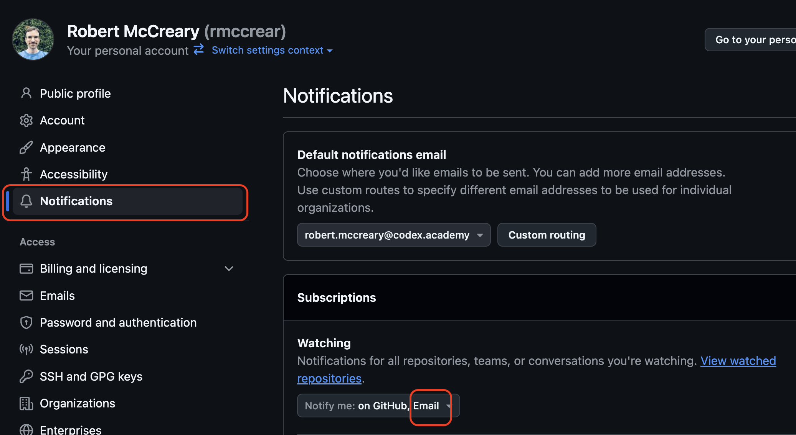
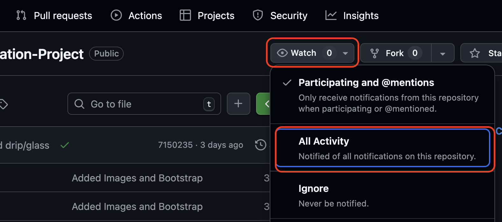

# How to Turn on GitHub Notifications

Never miss important feedback! Get notified when someone comments on your code.

## Types of Comments You'll Receive

- **Code review comments** on specific lines in commits
- **Issue discussions** in your repository
- **Pull request feedback** and conversations

## Setup Steps

### 1. Configure Email Notifications

1. Go to your **Profile** → **Settings**
2. Click **Notifications**
3. Ensure subscriptions are sent to your email address

### 2. Watch Your Repositories

For each repository you want to monitor:
1. Click the **Watch** button
2. Select **All Activity** to get notified of all comments

Now you'll never miss important feedback on your code!

